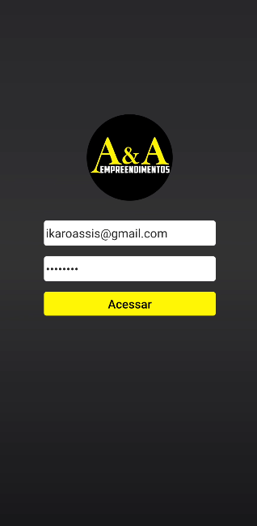
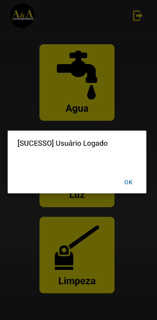
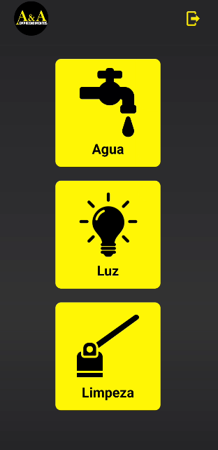
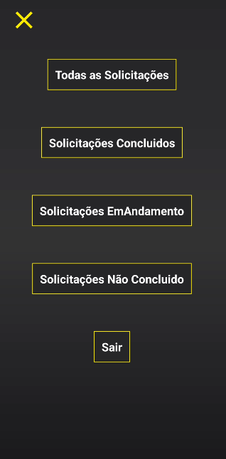
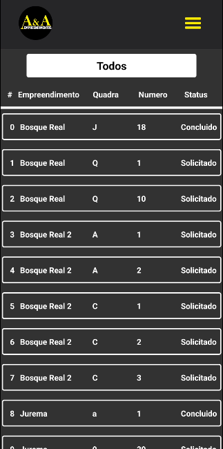
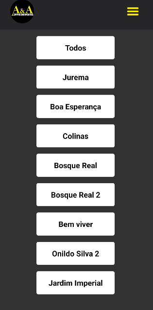
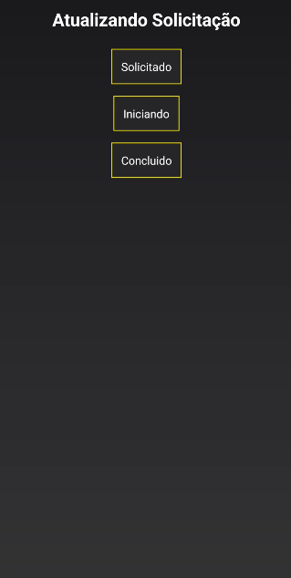
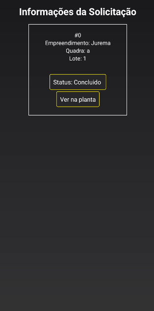
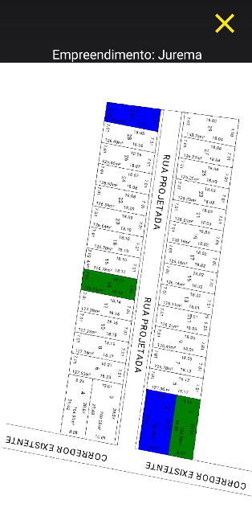

   
  <h1 align="center">20 - Pendencias Externas Part#2</h1>

 

## O projeto foi dividido em duas partes, a parte o web e mobile, Essa é a parte Mobile

# Sobre o projeto
### Essa é a parte 2 do projeto de pendencias externas, como foi dito na parte 1 do projeto as solicitações irão ficar no banco de dados no Firebase, logo o aplicativo irá consumir os dados das solicitações, na tela inicial irá ter as opções de água, energia e limpeza, assim que o usuario clicar ira ver todas as solicitações, onde ele poderá ver se foi concluida se esta em andamento ou se não foi concluida, poderar filtrar por empreendimentos, e poderar alterar o status da solicitação, e poderá esta vendo as solicitações na planta do empreendimento que ela pertence para ter uma melhor viabilidade 

## Layout 

- React Native
- TailwinCss/NativeWind
- FireBase
- Expo

# Autor

## @Duck.Web

<!-- INSTAGRAM -->

